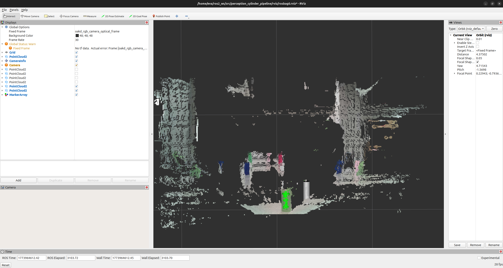
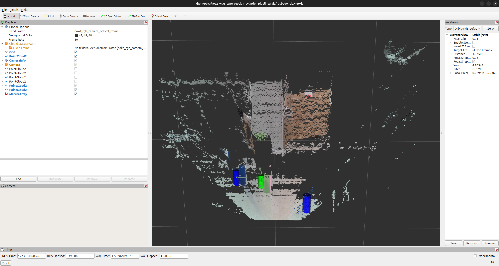
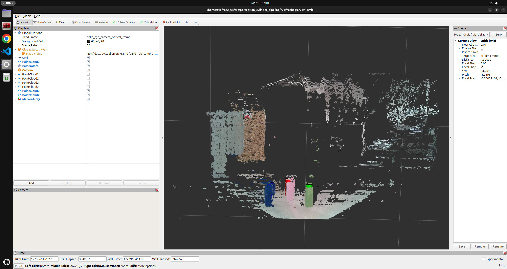

# perception_cylinder_pipeline

ROS 2 Python package for detecting colored cylinders from OAK-D RGB-D point clouds.

The pipeline subscribes to `/oakd/points`, filters/downsamples the cloud, removes the dominant plane, clusters object points, fits cylinder models, assigns semantic color labels (`red|green|blue|unknown`), and publishes both debug point clouds and RViz markers.

## Grader Quick Check

Use this table to quickly verify rubric coverage and where each requirement is implemented.

| Rubric Item | Points | Status | Evidence in Repo |
|---|---:|---|---|
| Data Preprocessing (box filter + voxel downsample) | 3 | Completed | `box_filter()` and `voxel_downsample()` in `perception_cylinder_pipeline/pipeline.py`; debug topics `/pipeline/stage_box`, `/pipeline/stage_downsample` in `perception_cylinder_pipeline/cylinder_processor_node.py` |
| Plane Segmentation (RANSAC floor/ceiling removal) | 3 | Completed | `find_plane_ransac()` + `remove_plane_inliers()` in `perception_cylinder_pipeline/pipeline.py`; debug topic `/pipeline/stage_no_plane` |
| Cylinder Detection (RANSAC with point-normal geometry) | 5 | Completed | `estimate_normals()`, `find_single_cylinder()`, `fit_cylinders_in_clusters()` in `perception_cylinder_pipeline/pipeline.py`; debug topic `/pipeline/stage_cylinders` |
| Semantic Labeling (RGB to HSV color labels) | 3 | Completed | `rgb_to_hsv()` and `semantic_label_from_rgb()` in `perception_cylinder_pipeline/pipeline.py`; marker coloring in `perception_cylinder_pipeline/visualization.py` |
| ROS Integration (PointCloud2 stages + MarkerArray) | 1 | Completed | Stage publishers and marker publisher in `perception_cylinder_pipeline/cylinder_processor_node.py`; RViz configs in `rviz/perception_pipeline.rviz`, `rviz/rosbag0.rviz` |

### Assignment Task Completion Matrix

| Pipeline Task | Requirement Summary | Status | Evidence |
|---|---|---|---|
| Task 0: Preprocessing | ROI box filter and voxel downsampling for real-time performance | Completed | `box_filter()`, `voxel_downsample()`, stage topics and logs |
| Task 1: Floor/Ceiling Removal | Dominant horizontal plane via RANSAC and remove inliers | Completed | `find_plane_ransac()`, `remove_plane_inliers()` |
| Task 2: Euclidean Clustering | Group non-plane points into object clusters | Completed | `euclidean_clustering()`, `extract_clusters()` |
| Task 3: Cylinder Detection | Cylinder RANSAC using normals and inlier radius check | Completed | `find_single_cylinder()`, `fit_cylinders_in_clusters()` |
| Task 4: Semantic Color Labels | RGB->HSV and label cylinders by hue bands | Completed | `rgb_to_hsv()`, `semantic_label_from_rgb()`, marker label colors |

### Bag Evidence

| Rosbag | Output Snapshot |
|---|---|
| rgbd_bag_0 | `media/rosbag_0.png` |
| rgbd_bag_1 | `media/rosbag_1.png` |
| rgbd_bag_2 | `media/rosbag_2.png` |

## Features

- PointCloud2 parsing with aligned RGB decoding
- Box filtering and voxel downsampling
- Surface normal estimation (k-NN + SVD)
- Floor/plane removal using RANSAC
- Euclidean clustering of object candidates
- Cylinder fitting with RANSAC per cluster
- Semantic color labeling from cylinder inlier RGB
- MarkerArray visualization on `/viz/detections`

## Package Layout

- `perception_cylinder_pipeline/cylinder_processor_node.py`  
	Main ROS 2 node and pipeline orchestration.
- `perception_cylinder_pipeline/pipeline.py`  
	Core geometry and perception functions + `PipelineConfig`.
- `perception_cylinder_pipeline/pc2_utils.py`  
	PointCloud2 parsing/build helpers.
- `perception_cylinder_pipeline/visualization.py`  
	MarkerArray publishing helpers for RViz cylinder markers.

## ROS Interfaces

### Subscribed Topics

- `/oakd/points` (`sensor_msgs/msg/PointCloud2`)

### Published Topics

Debug cloud topics:

- `/pipeline/stage_valid` (`sensor_msgs/msg/PointCloud2`)
- `/pipeline/stage_box` (`sensor_msgs/msg/PointCloud2`)
- `/pipeline/stage_downsample` (`sensor_msgs/msg/PointCloud2`)
- `/pipeline/stage_no_plane` (`sensor_msgs/msg/PointCloud2`)
- `/pipeline/stage_clusters` (`sensor_msgs/msg/PointCloud2`)
- `/pipeline/stage_cylinders` (`sensor_msgs/msg/PointCloud2`)

Visualization topic:

- `/viz/detections` (`visualization_msgs/msg/MarkerArray`)

## Dependencies

Declared in `package.xml`:

- `rclpy`
- `sensor_msgs`
- `visualization_msgs`
- `geometry_msgs`

Python dependency used in pipeline:

- `scipy` (`scipy.spatial.cKDTree`)

If `scipy` is missing in your environment:

```bash
pip install scipy
```

## Configuration (PipelineConfig)

All major tuning values are centralized in:

- `perception_cylinder_pipeline/pipeline.py` → `PipelineConfig`

Common tuning parameters:

- `voxel_size`
- `cluster_dist_thresh`
- `min_cluster_size`
- `max_cluster_size`
- `cyl_radius`
- `cyl_radius_thresh`
- `cylinder_ransac_iters`
- `min_cylinder_inliers`

## Step-by-Step: Build and Run

From your workspace root (`~/ros2_ws`):

### 1) Build this package

```bash
cd ~/ros2_ws
colcon build --packages-select perception_cylinder_pipeline
```

### 2) Source workspace

```bash
source ~/ros2_ws/install/setup.bash
```

### 3) Run the perception node (Terminal A)

```bash
ros2 run perception_cylinder_pipeline cylinder_processor_node
```

### 4) Play a bag file (Terminal B)

Example for `rgbd_bag_2`:

```bash
cd ~/ros2_ws
source install/setup.bash
ros2 bag play bags/rgbd_bag_2 --loop --rate 0.5
```

You can similarly play:

- `bags/rgbd_bag_0`
- `bags/rgbd_bag_1`

### 5) Open RViz2 with saved config (Terminal C)

```bash
cd ~/ros2_ws
source install/setup.bash
rviz2 -d ~/ros2_ws/src/perception_cylinder_pipeline/rviz/rosbag0.rviz
```

### 6) Verify RViz loaded correctly

The saved layout in `rviz/perception_pipeline.rviz` should already include the pipeline point cloud displays and `/viz/detections` MarkerArray.

If frame transforms differ for a bag, only adjust RViz `Fixed Frame` as needed.

## Sample Detections

Below are example detection results from processing the three provided rosbags:

### Rosbag 0 Detection


### Rosbag 1 Detection


### Rosbag 2 Detection


## Marker Semantics

Each detected cylinder is shown as a `CYLINDER` marker in namespace `detections`.

- Label `green` → green marker
- Label `red` → red marker
- Label `blue` → blue marker
- Label `unknown` → gray/white marker

Markers are cleared every callback and republished (clear message first, marker message second) to avoid RViz duplicate marker warnings.

## Runtime Logs

The node logs useful per-frame stats, including:

- `cluster_count`
- `cluster_sizes`
- `cylinder_count`
- `cylinder_inlier_counts`
- `cylinder_points`
- `cylinder_labels`
- `cylinder_avg_rgb`
- `cylinder_avg_hsv`

## Quick Debug Commands

List pipeline topics:

```bash
ros2 topic list | grep pipeline
```

Check marker topic:

```bash
ros2 topic echo /viz/detections --once
```

## Code Architecture & Pipeline Walkthrough

### Overall Data Flow

The perception pipeline is a linear 10-stage processing chain executed synchronously in `cylinder_processor_node.pointcloud_callback()`:

1. **Parse PointCloud2** → Convert ROS message to NumPy arrays with aligned RGB
2. **Validity check** → Filter NaN/infinite values → `stage_valid`
3. **Box filter** → Keep only points within region of interest → `stage_box`
4. **Voxel downsample** → Uniform spacing grid reduction → `stage_downsample`
5. **Normal estimation** → k-NN SVD for surface orientations → (no publish)
6. **Plane RANSAC** → Detect and remove floor/dominant plane → `stage_no_plane`
7. **Euclidean clustering** → Group nearby remaining points → `stage_clusters`
8. **Cylinder RANSAC** → Fit cylinders to each cluster → `stage_cylinders`
9. **Semantic labeling** → Classify colors (red/green/blue/unknown) via HSV hue bands
10. **Publish markers** → Visualize cylinders in RViz with semantic colors

Each stage is represented as a function in `pipeline.py`, with debug publishers at key checkpoints.

### Module Responsibilities

**`cylinder_processor_node.py`** (Entry point, Node orchestration)
- `main()` → Creates ROS 2 node, subscribers, publishers
- `pointcloud_callback()` → Reads config, calls all 10 pipeline stages in sequence, handles exceptions, logs statistics
- Manages `PipelineConfig` instance and publishes to both debug and marker topics

**`pipeline.py`** (Core algorithms, Configuration)
- **`PipelineConfig`** dataclass: Centralized repository for 26 tuning parameters
  - Box bounds: `box_x_min/max`, `box_y_min/max`, `box_z_min/max`
  - Downsampling: `voxel_size`
  - Normal estimation: `normal_search_k`
  - Plane RANSAC: `plane_ransac_thresh`, `plane_ransac_iters`, `plane_normal_align_thresh`
  - Clustering: `cluster_dist_thresh`, `min_cluster_size`, `max_cluster_size`
  - Cylinder RANSAC: `cyl_radius`, `cyl_radius_thresh`, `min_cylinder_inliers`, `max_cylinders`, `cylinder_ransac_iters`
  - Color thresholds: HSV hue band boundaries for red/green/blue

- **Geometric functions:**
  - `box_filter()` → Remove points outside region of interest
  - `voxel_downsample()` → Average-based grid downsampling for computational efficiency
  - `estimate_normals()` → k-NN local neighborhood + SVD on covariance matrix to estimate per-point surface normals
  - `find_plane_ransac()` → Iteratively sample 3 inlier points, test plane model, prefer planes with upward-facing normals (floor detection)
  - `euclidean_clustering()` → cKDTree radius search to group points with `cluster_dist_thresh` spacing; filter by size bounds
  - `find_single_cylinder()` → RANSAC: sample 2 normals, compute axis as their cross product, measure perpendicular distances, count inliers within radius band `[cyl_radius - thresh, cyl_radius + thresh]`
  - `fit_cylinders_in_clusters()` → Apply cylinder RANSAC to each cluster independently, return up to `max_cylinders` per cluster

- **Color classification:**
  - `rgb_to_hsv()` → Convert RGB triplets to HSV
  - `semantic_label_from_rgb()` → Classify inlier RGB values by HSV hue angle: red (0–30° or 330–360°), green (60–180°), blue (180–270°), else unknown

**`pc2_utils.py`** (PointCloud2 Message Handling)
- **`ParsedPointCloud`** dataclass: Holds xyz coordinates (Nx3), RGB as uint32 (N,), and original PointCloud2 header
- `pointcloud2_to_xyz_arrays()` → Parse PointCloud2 fields, extract x/y/z/rgb field offsets, handle byte-order differences, unpack packed RGB from float32 bit representation, filter invalid points
- `build_pointcloud2_from_xyz_rgb()` → Reconstruct PointCloud2 message: create field structs, pack xyz + rgb into NumPy bytes, create PointCloud2 with proper frame_id and timestamp

**`visualization.py`** (RViz Integration)
- **`CylinderMarkerPublisher`** class: Wraps marker publishing logic
  - `publish()` → Two-message strategy: first publish MarkerArray with single DELETEALL marker (to clear previous detections), then publish separate MarkerArray with new cylinder markers
  - `_label_to_color_rgba()` → Map semantic labels (`red|green|blue|unknown`) to RGBA tuples for RViz visualization
  - Each cylinder marker uses namespace `detections` and unique `id` for stable RViz rendering

### Key Design Decisions

1. **Linear synchronous pipeline:** Single callback processes one cloud fully before next arrival. No multi-threading or frame buffering.
2. **Centralized config:** All 26 parameters in one `PipelineConfig` dataclass accessible from node for quick parameter tuning without recompilation.
3. **Debug publishers at every stage:** Each pipeline step publishes its output cloud, enabling visual inspection in RViz to diagnose failures.
4. **Per-cluster cylinder fitting:** Each cluster receives independent RANSAC fitting, allowing multi-object detection in single frame.
5. **HSV-based semantic labeling:** Uses hue angle bands for robust color classification across lighting variations (more stable than direct RGB thresholding).
6. **Two-message marker strategy:** DELETEALL marker published separately from cylinder markers to avoid RViz duplicate marker errors.

### Example: Processing a Single Cylinder

1. Raw cloud from OAK-D sensor arrives (~1M points)
2. Box filter: Keep only region around table → ~500k points
3. Voxel downsample: ~50k points remain at uniform spacing
4. Normal estimation: SVD on k=10 neighbors for each point
5. Plane RANSAC: Find and exclude floor → ~10k points (object candidates)
6. Euclidean clustering: Group into clusters of nearby points → e.g., 1 cluster with 8k inliers (the cylinder)
7. Cylinder RANSAC: Fit dozens of candidate axes, accept best fit with ≥1000 inliers within radius band
8. Color labeling: Average RGB of 1000 inlier points, convert to HSV, check hue angle: 120° → **green**
9. Publish marker: Green `CYLINDER` marker at detected center/radius to RViz
10. Publish debug clouds: Each stage's output visible in RViz for debugging

### Performance Notes

- **Latency:** ~50–200 ms per frame (depends on input cloud size and RANSAC iterations)
- **Memory:** Moderate; largest data structure is downsampled cloud (~50k points × 4 floats = 800 KB)
- **Frequency:** Robust to 10–30 Hz input streams; higher frequencies may skip frames if processing lags

## Notes for Tuning Stability

For improved consistency (for example, the third cylinder in `rgbd_bag_2`), prefer incremental tuning in this order:

1. Slightly increase `cluster_dist_thresh` (reduce cluster fragmentation)
2. Slightly increase `cyl_radius_thresh` (allow more radius tolerance)
3. Slightly reduce `min_cylinder_inliers` (accept marginal but valid detections)


